# One_course_bot

# Bot User-Flow

```mermaid
flowchart TD
    /menu --> /topics;
    /menu --> /checkpoints;
    /menu --> /info;
    /menu --> /schedule;
    /menu --> /FAQ;
    /menu --> /knowledge;
    /menu --> /personal;
    /menu --> /team;
    
    /topics:::goog --> tl[Список разделов курса];
    tl[Список разделов курса]:::goog --> ct([Выбор одного из разделов]);
    ct([Выбор одного из разделов]) --> tthl[Список тем к разделу];
    tthl[Список тем к разделу]:::goog --> cth([Выбор одной из тем]);
    cth([Выбор одной из тем]) --> traz[Раздатка]:::goog;
    cth([Выбор одной из тем]) --> thw[ДЗ]:::goog;
    cth([Выбор одной из тем]) --> topr[Опрос]:::goog;
    cth([Выбор одной из тем]) --> tlink[Ссылки]:::goog;
    cth([Выбор одной из тем]) --> tched[Расписание]:::goog;

    traz[Раздатка] --> topinfo((Инфа));
    thw[ДЗ] --> topinfo((Инфа));
    topr[Опрос] --> topinfo((Инфа));
    tlink[Ссылки] --> topinfo((Инфа));
    tched[Расписание] --> topinfo((Инфа));
    
    ct([Выбор одного из разделов]) --> kt[КТ];
    kt[КТ] --> cases[Список кейсов]:::goog;
    kt[КТ] --> met[Методика]:::goog;
    kt[КТ] --> send[Отправить на проверку]:::goog;

    cases[Список кейсов] --> toplis((Инфа));
    met[Методика] --> toplis((Инфа));
    
    
    /checkpoints:::goog --> ktlist[Список ОТКРЫТЫХ КТ]:::goog;
    ktlist[Список ОТКРЫТЫХ КТ] --> ckt([Выбор КТ]);
    ckt([Выбор КТ]) --> kt[КТ]:::goog;
    
    /info --> coi((О курсе));
    
    /schedule --> schedlec[Расписание лекций];
    /schedule --> schedsem[Расписание семинаров];
    /schedule --> schedkt[Расписание КТ];
    /schedule --> schedweek[На ближайшую неделю];
    /schedule --> schedmonth[На ближайший месяц];
    
    schedlec[Расписание лекций]:::goog --> schout((Расписание));
    schedsem[Расписание семинаров]:::goog --> schout((Расписание));
    schedkt[Расписание КТ]:::goog --> schout((Расписание));
    schedweek[На ближайшую неделю]:::goog --> schout((Расписание));
    schedmonth[На ближайший месяц]:::goog --> schout((Расписание));
    
    /FAQ --> write[Написать преподавателю];
    /FAQ --> quesh[Часто задаваемые вопросы]:::goog;
    quesh[Часто задаваемые вопросы] --> fout((Вопрос-ответ))
    
    /knowledge:::goog--> kmet[Методики]:::goog;
    /knowledge --> kzan[Заначка]:::goog;
    kmet[Методики] --> kinfo((Инфа));
    kzan[Заначка] --> kinfo((Инфа));
    
    /personal:::goog --> isreg{Зарегистрирован?};
    isreg{Зарегистрирован?} --> |ДА| aboutyou((О себе));
    isreg{Зарегистрирован?} --> |ДА| pchange[Редактировать]:::goog;

    isreg{Зарегистрирован?} --> |НЕТ| preg[Регистрация]:::goog;

    
    /team:::goog --> isteam{В команде?};
    isteam{В команде?}--> |ДА| tleave[Покинуть команду]:::goog;
    isteam{В команде?} --> |ДА| tinfo((О команде));
    isteam{В команде?} --> |НЕТ| tjoin[Вступить в команду]:::goog;
    isteam{В команде?} --> |НЕТ| tcreate[Создать команду]:::goog;

    classDef goog fill:blue
```



## Содержание

- [Установка](#установка)
- [GoogleAPI](#google)

## Установка <a name="установка"></a>

Установка и запуск проекта

```bash
git clone https://github.com/V0D14Ka/One_course_bot.git
cd One_course_bot
touch \.env
```
Поместите в файл .env, пример .env-example:
  - TOKEN - Токен телеграмм бота.
  - TOPICS_SPREADSHEET_ID - id гугл таблицы "Разделы".
  - KNOWLEDGE_SPREADSHEET_ID - id гугл таблицы "База знаний".
  - FAQ_SPREADSHEET_ID - id гугл таблицы "FAQ".
  - GROUP_SPREADSHEET_ID - id гугл таблицы "Группы.
  - CALENDAR_ID - id гугл календаря с расписанием.
  - CHECKPOINTS_FOLDER - id гугл папки для загрузки ДЗ в КТ "Контрольные точки".
  - DB_URL - База данных для Tortoise ORM.

Затем поместите в корневую папку проекта json файл service_account_credentials.

Продолжаем установку и запуск
```bash
pip install -r requirements.txt
python telegram_bot.py
```

## GoogleAPI <a name="google"></a>
Ссылки на используемые таблицы:
  - [Разделы](https://docs.google.com/spreadsheets/d/1vHCGeH0nuCY7tbp-7eo4IbcjoXiXpoX2Sg2NLp6HVAY)
  - [Банк знаний](https://docs.google.com/spreadsheets/d/1UzMVOBYZPReVd74GWikXJncPWOvrRA0KzTspehdMNk0)
  - [FAQ](https://docs.google.com/spreadsheets/d/1-P57JngHJayTGgZqEV5uGShdapkpgqPsQUyDdwR7i7Q)
  - [Группы](https://docs.google.com/spreadsheets/d/1DWoyVUyDYwDiXO2Tw-n_vweb0z5UE2WRaSODiOG6Eo4)

Ссылки на Google Drive:
  - [Тестовая папка загрузки](https://drive.google.com/drive/u/1/folders/1KU8WOgqxc9LmVonxF2IEdT9bkYyQBqce)

Описание методов класса:
  - ```is_chapter_active(chapter)``` - проверка возможности показать раздел.
  - ```get_topics()``` - получение списка активных разделов
  - ```get_themes(chapter)``` - получение тем выбранного раздела.
  - ```get_theme_info(chapter, theme)``` - получение информации о выбранной теме.
  - ```get_checkpoint(chapter)``` - получение информации о выбранном чекпоинте.
  - ```get_knowledge(chapter)``` - получение методов базы знаний выбранного раздела.
  - ```get_method_info(chapter, method_id)``` - получение материала по выбранному методу.
  - ```upload(file_url, username, folder_id, chapter) ``` - загрузка ДЗ в КТ.
  - ```get_faq():``` - получение списка часто задаваемых вопросов.
  - ```get_lessons_dates(summary)``` - получение расписаний выбранных мероприятий.
  - ```get_period_lessons(period)``` - получение расписаний мероприятий за выбранный период.
  - ```check_user(group, full_name)``` - проверка информации о регистрации пользователя.
  - ```check_user_team``` - получение информации о членстве студента в команде.
  - ```get_team_col(group, full_name)``` - получения номера ячейки с информацией о команде студента.
  - ```delete_team(team)``` - удаляет команду и исключает всех студентов из нее.
  - ```set_team(admin, col, group)``` - ставит id команды в соответствующую ячейку таблицы.
  - ```set_id(tg_id, col, group)``` - устанавливает telegram_id студенту, после регистрации.
